<p align="center"><picture><source media="(max-width: 640px)" srcset="assets/banner-m.svg"></picture></p>

<p align="center"><a href="mailto:madhurrishis.is24@rvce.edu.in"></a> <a href="https://www.linkedin.com/in/madhur-sikarwar-025b87342/"></a> <a href="https://github.com/MadhurSikarwar"></a></p>

<p align="center"><picture><source media="(max-width: 640px)" srcset="assets/now-m.svg"></picture></p>

<p><picture><source media="(max-width: 640px)" srcset="assets/div-featured-m.svg"></picture></p>

<p align="center"><a href="https://github.com/MadhurSikarwar/GDGSpaceTech"><picture><source media="(max-width: 640px)" srcset="assets/orbitwatch-m.svg"></picture></a></p>

<p align="center">Built with Mayur M Deekshith · MySQL with a database account per role, sharded MongoDB, Flask, SGP4, CesiumJS · <a href="https://github.com/MadhurSikarwar/GDGSpaceTech">Repository</a> · <a href="https://www.youtube.com/watch?v=Be4tBh7HUjg">Demo video</a></p>

<p><picture><source media="(max-width: 640px)" srcset="assets/div-index-m.svg"></picture></p>

<p align="center"><picture><source media="(max-width: 640px)" srcset="assets/index-m.svg"></picture></p>

<p><picture><source media="(max-width: 640px)" srcset="assets/div-work-m.svg"></picture></p>

<p align="center">
<a href="https://github.com/Bhavya-Chawat/ResQMesh"></a>&nbsp;
<a href="https://github.com/thinbearr/fIndia-AI"></a>&nbsp;
<a href="https://github.com/MadhurSikarwar/PromptArcade"></a>&nbsp;
<a href="https://github.com/MadhurSikarwar/Swarlaya-Music"></a>&nbsp;
</p>

<p align="center"><sub>Play KRAKEN in the browser: <a href="https://prompt-arcade-gilt.vercel.app">prompt-arcade-gilt.vercel.app</a></sub></p>

<details>
<summary><b>More projects</b></summary>
<br>

| Project | What it does | Built with |
|---|---|---|
| [Suraksha Intelligence](https://github.com/MadhurSikarwar/Suraksha-Hackathon) | Hackathon project: a multi-modal AI pipeline that checks property title deeds for forgery, aimed at Indian banks. | Python |
| [TOOL](https://github.com/MadhurSikarwar/TOOL) | An audio-reactive 3D visualizer: 80,000 GPU particles and a kaleidoscopic shader driven by live frequency analysis, in six visual modes. | TypeScript, GPU shaders |
| [Algal bloom dashboard](https://github.com/MadhurSikarwar/Algal-Bloom-Prediction) | ESP32 water-quality sensors (pH, turbidity, TDS, dissolved oxygen) feed a live dashboard that estimates bloom probability, with alerts and PDF/CSV export. | ESP32, ThingSpeak, JavaScript |
| [ECOSAT](https://github.com/MadhurSikarwar/Algal-Bloom-Satellite) | Algal-bloom risk platform that combines a satellite-based model with an offline sensor-based one. | Web |
| [File Integrity Checker](https://github.com/MadhurSikarwar/File-Integrity-Checker) | A desktop security tool with 18 features: baseline snapshots, change detection and a real-time directory watchdog. | C, GTK3, SQLite, OpenSSL |
| [Cheating detection](https://github.com/MadhurSikarwar/Emotion-Tracking-Hacknite-Hackathon-) | Flags cheating from emotion and eye-movement tracking (Hacknite hackathon). | Python |
| [Downloader](https://github.com/MadhurSikarwar/Downloader) | A desktop video and audio downloader with a Tkinter interface on yt-dlp. | Python |

Also on my GitHub: data structures practice in C++, C programming, a logic gate simulator, an expense tracker, and IoT lab work.

</details>

<p><picture><source media="(max-width: 640px)" srcset="assets/div-stack-m.svg"></picture></p>

<p align="center"><picture><source media="(max-width: 640px)" srcset="assets/stack-m.svg"></picture></p>

<p><picture><source media="(max-width: 640px)" srcset="assets/div-whoami-m.svg"></picture></p>

```cpp
class Developer : public Engineer {
public:
    Developer() {
        name       = "Madhur Rishi Sikarwar";
        education  = "B.E. Information Science @ RVCE (CGPA: 9.37)";
        focus      = {"Embedded Systems", "Machine Learning", "Distributed Systems"};
        philosophy = "Own the system end to end, from firmware to UI.";
    }

    void execute() {
        while (true) { learn(); build(); optimize(); }
    }
};
```

<p align="center"><picture><source media="(max-width: 640px)" srcset="assets/footer-m.svg"></picture></p>
